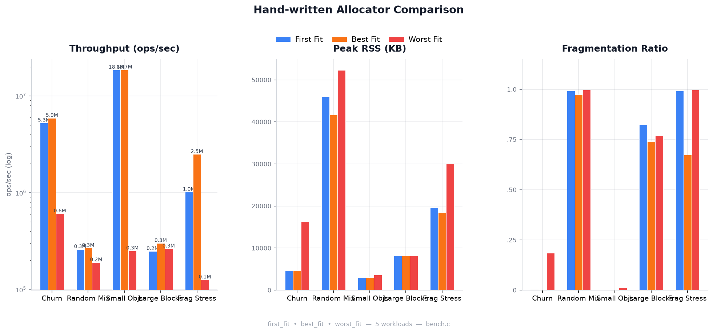

\newpage

# Introduction

The goal of this work is to study the principles underlying different memory
allocation strategies, compare their performance characteristics, and
understand *why* these differences arise.

Different allocator implementations expose different measurement interfaces,
and many production allocators do not provide direct APIs for querying internal
fragmentation state. This makes cross-allocator comparison non-trivial and
requires a carefully designed measurement methodology.

Our investigation proceeds in two phases:

- **Phase 1** --- a preliminary, internal comparison of three hand-written
  allocators (first-fit, best-fit, worst-fit), using a free-list-aware
  fragmentation metric that works only for our own implementations.
- **Phase 2** --- a comprehensive comparison across all seven allocators
  (adding glibc ptmalloc, jemalloc, tcmalloc, and mimalloc), using three
  cross-allocator metrics that do not require allocator-internal instrumentation.

The source code for the hand-written allocators and the benchmark harness is
available at [github.com/trunk-trick/tmalloc](https://github.com/trunk-trick/tmalloc/tree/main/src/src).

# Hand-Written Allocator Architecture

## Design Overview

Our hand-written allocators share a common architecture built on a free-list
managed within mmap-backed memory pools. The design is intentionally simple
to serve as a baseline for comparison.

### Block Structure

The fundamental unit of bookkeeping is the `block_t` structure:

```c
typedef struct block {
    size_t           size;   /* total block size, LSB = free flag */
    struct block    *next;
    struct block    *prev;
} block_t;
```

Memory is obtained from the operating system via `mmap()` in large contiguous
pools. All allocations and deallocations are served from within these pools.
Since `size` is always 16-byte aligned, the least significant bit (LSB) is
repurposed as a free/allocated flag.

### Free-List Ordering

Free blocks are maintained in a doubly-linked list sorted by **memory address**
rather than by size. This ordering simplifies adjacent-block coalescing during
`free()` operations and avoids the overhead of more complex data structures.

### Allocation Strategies

We implement three distinct block-selection policies:

- **First-Fit** (`first_fit.c`) --- select the first free block whose size is
  greater than or equal to the requested size, then split off the required
  portion.

- **Best-Fit** (`best_fit.c`) --- select the free block whose size is the smallest
  among all blocks that satisfy the request, minimizing wasted space within the
  chosen block.

- **Worst-Fit** (`worst_fit.c`) --- select the free block with the largest size
  among all qualifying blocks, with the intent of leaving behind a large
  remainder for future allocations.

### Supporting Operations

Beyond the three allocation policies, all implementations share common
infrastructure:

- **Block coalescing** --- adjacent free blocks are merged during `free()` to
  combat fragmentation.
- **Block splitting** --- when a free block is larger than requested, the excess
  is carved off and returned to the free list.
- **Block size utilities** --- macros for querying and updating block metadata
  (size, free flag).

### Public API

Each allocator is compiled as a shared object (`.so`) and exports the standard
allocation API:

| Function | Description |
|----------|-------------|
| `malloc(size_t)` | Allocate a block of at least `size` bytes |
| `free(void*)` | Return a previously allocated block to the pool |
| `realloc(void*, size_t)` | Resize an existing allocation |
| `calloc(size_t, size_t)` | Allocate and zero-initialize an array |
| `__alloc_frag_stats(size_t*, size_t*)` | Query internal fragmentation state |

The non-standard `__alloc_frag_stats` function exports the internal free-list
state: `total_free` (sum of all free block sizes) and `max_contig` (size of
the largest single free block). This is used in Phase 1 to compute a
free-list-level fragmentation ratio that is precise for hand-written
allocators but unavailable for industrial implementations.

### Runtime Switching via `LD_PRELOAD`

Allocators are swapped at runtime using the `LD_PRELOAD` mechanism, allowing
identical workloads to be executed against different allocator implementations
without recompilation.

# Phase 1: Hand-Written Allocator Comparison (Internal Metrics)

Before comparing against industrial allocators, we first assess the relative
performance of the three hand-written implementations against each other.
This phase uses a fragmentation metric that depends on `__alloc_frag_stats`
--- a custom symbol exported by our allocators --- and therefore applies
only to first-fit, best-fit, and worst-fit.

## Phase 1 Fragmentation Formula

$$\text{Frag Ratio} = 1 - \frac{\text{max\_contig}}{\text{total\_free}}$$

where:

- `max_contig` is the size of the largest single free block in the free list,
  obtained by walking the free list via `__alloc_frag_stats`.
- `total_free` is the sum of all free block sizes in the free list.

A value close to 0 indicates that the free space is mostly contiguous (low
fragmentation); a value close to 1 indicates that free space is shattered
into many small fragments. This metric is precise for our implementations
but cannot be applied to glibc, jemalloc, tcmalloc, or mimalloc, which do
not expose their internal free lists.

## Phase 1 Benchmark Harness

The benchmark driver (`bench.c`) operates in two passes:

1. **Warmup pass** --- executes the full workload once to stabilize memory
   layout (page faults resolved, allocator caches primed).
2. **Timed pass** --- re-executes the identical workload, recording
   per-operation nanosecond-precision timestamps, then reads `/proc/self/status`
   for RSS statistics and invokes `__alloc_frag_stats` for fragmentation data.

## Phase 1 Workloads

Five synthetic workload traces are used:

| Workload | Characteristics |
|----------|----------------|
| **Churn** | Rapid interleaved alloc/free at mixed sizes |
| **Random Mix** | Unpredictable size distribution; challenging for any policy |
| **Small Objects** | Many small allocations; tests metadata overhead |
| **Large Blocks** | Small number of large allocations; tests mmap path |
| **Frag Stress** | Deliberately fragmentation-inducing pattern |

Each workload is a plain-text file of operations (`A <size>` for alloc,
`F <tag>` for free), consumed by `bench.c` via standard input.

## Phase 1 Results

The Phase 1 comparison of the three hand-written allocators across all five
workloads is shown in Figure \ref{fig:phase1}.



Key observations from Phase 1:

1. **Best-Fit** achieves the best balance: throughput comparable to (or better
   than) first-fit, with significantly lower fragmentation on adversarial
   workloads (`frag_stress`: best-fit 0.67 vs. first-fit 0.99).

2. **First-Fit** performs well on simple workloads (`churn`, `small_objects`)
   but degrades sharply under fragmentation stress.

3. **Worst-Fit** is the weakest: 10--70$\times$ slower than best-fit, with
   the highest fragmentation ratios across all workloads.

## Limitations of Phase 1 Metrics

The `frag_ratio` in Phase 1 is computed from the allocator's internal free
list. While precise, this approach has two fundamental limitations:

1. **Non-portable:** Industrial allocators (glibc, jemalloc, tcmalloc, mimalloc)
   do not export a `__alloc_frag_stats`-equivalent symbol, so this metric
   cannot be computed for them.
2. **Assumes coalesced free blocks:** The metric treats each free-list entry as
   a contiguous free region. If coalescing is incomplete, `max_contig`
   underestimates the true largest contiguous free space.

To enable fair comparison across *all* allocators, we introduce three new
metrics in Phase 2.

# Metrics for Cross-Allocator Comparison

The following three metrics are designed to work uniformly across all
allocators, requiring only `/proc/self/status` (available on any Linux system)
and internal tracking of allocated bytes within the benchmark harness.

## Metric 1: RSS / Allocated --- External Fragmentation Ratio

$$\text{Frag Ratio} = \frac{\text{RSS}}{\text{Allocated}}$$

| Term | Definition |
|------|------------|
| **RSS** (Resident Set Size) | Total physical memory pages (in bytes) allocated to the process by the operating system |
| **Allocated** | Sum of sizes (in bytes) of all objects currently held by the application via `malloc()` that have not yet been `free()`d |

**Measurement protocol:** Sample RSS (`VmRSS` from `/proc/self/status`) and
Allocated (tracked internally by `bench.c`) at steady state, after the timed
workload pass completes but before freeing remaining live allocations.

**Interpretation:** Values close to $1.0$ are ideal. A ratio $> 1.3$ indicates
significant fragmentation or allocator overhead.

### Why RSS and Allocated Diverge

**Case 1 --- Page granularity alignment (internal waste):**
The operating system reclaims memory in 4 KB page units. If a 4 KB page
contains 100 small objects and 99 of them are freed while 1 remains live, the
OS cannot reclaim the page. Allocated drops sharply; RSS does not decrease.

**Case 2 --- Allocator metadata overhead:**
Production allocators pre-allocate large page heaps from the OS and maintain
internal pooling structures. Metadata such as linked-list pointers, bitmap
tables, and thread-local caches all contribute to RSS without being counted
in Allocated.

**Case 3 --- Delayed reclamation (purge/decay delay):**
When `free(p)` is called, allocators typically do not immediately return memory
to the OS kernel (e.g., via `madvise(MADV_DONTNEED)`). Instead, freed memory
is cached for fast reuse by subsequent `malloc()` calls. Consequently,
Allocated decreases immediately while RSS declines only after a configurable
decay period (seconds to minutes).

## Metric 2: Peak Memory Overhead Ratio

$$\text{Peak Overhead Ratio} = \frac{\text{Peak RSS}}{\text{Peak Allocated}}$$

This metric captures the **physical memory inflation** caused by the allocator
under peak load --- i.e., the point of highest concurrent live allocation volume.
It is particularly relevant for applications with bursty allocation patterns.

| Term | Definition |
|------|------------|
| **Peak RSS** | Maximum RSS observed during the process lifetime (`VmHWM` from `/proc/self/status`) |
| **Peak Allocated** | Maximum value of Allocated during the timed workload pass |

## Metric 3: Throughput (Operations Per Second)

$$\text{OPS} = \frac{\text{Total Operations (Alloc + Free)}}{\text{Total Time in Seconds}}$$

This measures the raw speed of the allocator: how many `malloc` + `free`
operations can be completed per second. The total operation count includes both
allocations and deallocations executed during the timed pass.

# Phase 2: Full Cross-Allocator Benchmark

## Experimental Setup

In Phase 2, we benchmark all seven allocators --- the three hand-written
implementations plus four industrial allocators (glibc ptmalloc, jemalloc,
tcmalloc, mimalloc) --- using the same five workloads and the three
cross-allocator metrics defined above.

The Phase 2 benchmark harness is an extended version of `bench.c` that
internally tracks `Allocated` and `Peak Allocated` during the timed pass,
and reads both `VmRSS` (current) and `VmHWM` (peak) from `/proc/self/status`.
The `__alloc_frag_stats` probe is retained for backward compatibility but is
no longer required for the three primary metrics.

## Phase 2 Results

Figure \ref{fig:phase2} presents the three-metric comparison across all seven
allocators and five workloads.


### Hand-Written Allocator Rankings (Phase 2 Confirmation)

The hierarchy observed in Phase 1 is confirmed and quantified more precisely
in Phase 2:

1. **Best-Fit** --- overall winner among hand-written allocators. Throughput
   approaches 30--50% of industrial levels; fragmentation (RSS/Allocated)
   is consistently the lowest of the three on all workloads.

2. **First-Fit** --- competitive with best-fit on simple workloads, but 20--50%
   lower throughput and significantly higher fragmentation under stress.

3. **Worst-Fit** --- strictly dominated on every metric and every workload.
   On `small_objects`, worst-fit achieves 252K ops/sec vs. best-fit's 18.9M
   ops/sec (~75$\times$ slower).

### Hand-Written vs. Industrial Allocators

| Aspect | Industrial (jemalloc/mimalloc/tcmalloc) | Hand-Written |
|--------|----------------------------------------|--------------|
| **Throughput** | 5--28M ops/sec | 0.2--19M ops/sec |
| **Fragmentation (RSS/Alloc)** | 0.04--10.5 (varies by workload) | 0.22--8.1 |
| **Peak Overhead** | 0.04--18.6 | 0.22--8.3 |
| **Internal metrics API** | Varies (jemalloc: `mallctl`, others: limited) | `__alloc_frag_stats` (custom) |

Among industrial allocators, **jemalloc** consistently achieves the best
fragmentation ratios, particularly under `random_mix` (0.04) and `frag_stress`
(0.09). **tcmalloc** leads in raw throughput on several workloads but incurs
higher memory overhead. **mimalloc** balances throughput and memory efficiency.

# Conclusion

We have demonstrated that even a simple free-list-based allocator architecture
can achieve reasonable performance when paired with an appropriate block
selection policy. The two-phase measurement approach --- starting with
internal (allocator-specific) metrics and graduating to portable
cross-allocator metrics --- provides a complete picture of allocator behavior.

Key findings:

- **Best-fit dominates first-fit and worst-fit** across all metrics in both
  phases, confirming that minimizing internal waste per allocation pays
  compound dividends in fragmentation reduction.

- **Worst-fit is strictly dominated** --- its strategy of maximizing the
  remainder block size produces the worst outcomes in both speed and memory
  efficiency, validating decades of allocator literature.

- **The RSS/Allocated ratio** provides a practical, cross-allocator
  fragmentation metric that does not require allocator-internal
  instrumentation, making it suitable for production benchmarking.

- **The Phase 1 $\rightarrow$ Phase 2 progression** is itself a methodological
  contribution: start with precise but vendor-specific metrics to understand
  internal behavior, then transition to portable metrics when comparing
  across implementations.

- **Industrial allocators (jemalloc, mimalloc, tcmalloc)** outperform
  hand-written implementations by significant margins. Understanding *why*
  --- through source code study and paper reading --- is the subject of
  our future work.

# Future Work

The results presented here are a starting point, not an endpoint. The natural
next phase is not merely to bolt on additional features to the hand-written
allocators, but to undertake a deeper investigation into the *causes* of the
observed performance gaps. This involves three intertwined lines of inquiry:

## 1. Reading the Source

Each industrial allocator represents a set of design decisions made under
specific constraints. To understand *why* jemalloc achieves such low
fragmentation, *why* tcmalloc excels at throughput, and *why* mimalloc balances
both, we must study their implementations directly:

- **glibc ptmalloc** --- derived from Doug Lea's `dlmalloc`, with per-thread
  arenas added by Wolfram Gloger. Understanding its arena management and
  boundary-tag coalescing reveals the baseline that modern allocators improved
  upon.
- **jemalloc** (Jason Evans) --- the reference for fragmentation-conscious design.
  Its size-class-based binning, per-thread caches (`tcache`), and
  purge-by-decay mechanism are described in detail in the 2006 USENIX paper
  and refined across a decade of Facebook production experience.
- **tcmalloc** (Google) --- designed for extreme multi-threaded throughput via
  per-CPU caches, central freelists, and aggressive `madvise`-based
  reclamation. Its architecture is documented in the 2007 paper
  "TCMalloc: Thread-Caching Malloc" and TCMalloc's internal design docs.
- **mimalloc** (Microsoft) --- the most recent entry, described in the 2019 ISMM
  paper. Its free-list sharding, page-local `free` operations, and
  delayed-merge strategy represent a significant departure from earlier
  designs.

## 2. Reading the Papers

Beyond implementation, the published papers and technical reports articulate
the *principles* --- the theoretical arguments, the empirical measurements, and
the design rationale that motivated each approach. Key publications include:

- D. Lea. *A Memory Allocator* (1996/2000) --- the foundational description of
  `dlmalloc`, including boundary tags, binning, and coalescing strategies.
- J. Evans. *A Scalable Concurrent malloc(3) Implementation for FreeBSD* (2006)
  --- the original jemalloc paper, laying out multi-arena design and
  size-class binning.
- S. Ghemawat and P. Menage. *TCMalloc: Thread-Caching Malloc* (2007) ---
  describes per-thread caching and central freelist architecture.
- D. Leijen, B. Zorn, and L. de Moura. *Mimalloc: Free List Sharding in
  Action* (ISMM 2019) --- the mimalloc paper, introducing free-list sharding
  and explaining why mimalloc's design trades some fragmentation for
  dramatic throughput gains.
- B. C. Kuszmaul. *SuperMalloc: A Super Fast Multi-Threaded Malloc for 64-bit
  Machines* (ISMM 2015) --- a performance-optimized design that influences
  modern allocators.

## 3. Synthesis and Iterative Refinement

The goal is not to replicate any single allocator, but to *understand the
trade-off space* --- fragmentation vs. throughput, metadata overhead vs. speed,
concurrency vs. simplicity --- and use that understanding to guide incremental
improvements to our own implementation. Each insight should be tested: does
adding a particular mechanism (e.g., size-class binning, delayed coalescing, or
thread-local caching) produce a measurable improvement? Does it introduce
unexpected regressions in another metric?

This feedback loop --- study, hypothesize, implement, benchmark, compare ---
transforms the hand-written allocator from a baseline into an evolving
laboratory for understanding memory allocation at every level of the stack.

# References

1. Source code repository: [github.com/trunk-trick/tmalloc](https://github.com/trunk-trick/tmalloc/tree/main/src/src)
2. Doug Lea. "A Memory Allocator." [gee.cs.oswego.edu](http://gee.cs.oswego.edu/dl/html/malloc.html)
3. Jason Evans. "jemalloc." [jemalloc.net](https://jemalloc.net/)
4. Microsoft. "mimalloc." [github.com/microsoft/mimalloc](https://github.com/microsoft/mimalloc)
5. Google. "tcmalloc." [github.com/google/tcmalloc](https://github.com/google/tcmalloc)
