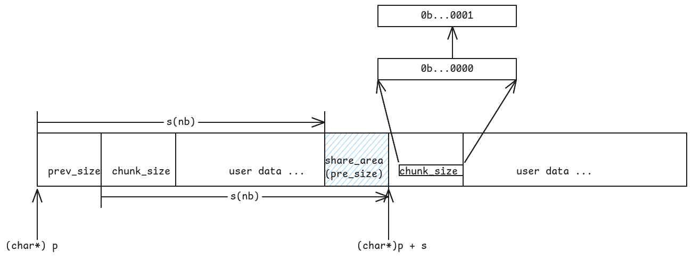

# Introduction: What Is malloc?

malloc is used for dynamic memory allocation. But the real question is: how does it work under the hood, and specifically, how does it keep memory fragmentation under control?

We start with `_int_malloc` --- the core allocation function. Rather than memorizing every line of code, we only look up the details when necessary. At its heart, this is an art of bytes.

# The Chunk: The Fundamental Unit

```c
struct malloc_chunk {
1137 
1138   INTERNAL_SIZE_T      mchunk_prev_size;  /* Size of previous chunk (if free).  */
1139   INTERNAL_SIZE_T      mchunk_size;       /* Size in bytes, including overhead. */
1140 
1141   struct malloc_chunk* fd;         /* double links -- used only if free. */
1142   struct malloc_chunk* bk;
1143 
1144   /* Only used for large blocks: pointer to next larger size.  */
1145   struct malloc_chunk* fd_nextsize; /* double links -- used only if free. */
1146   struct malloc_chunk* bk_nextsize;
1147 };
```

it feels not difficult to find that it is just a link list, that's possibly why we need to learn the data structure before we dive into it.

# Size Computation and Alignment

When malloc gets the size info, it processes it this way:
```c
3878   nb = checked_request2size (bytes);
```

we can find in the func `checked_request2size` that it allocates chunks based on the size of request ! As is shown in the code :

```c
1314 #define request2size(req)                                         \
1315   (((req) + SIZE_SZ + MALLOC_ALIGN_MASK < MINSIZE)  ?             \
1316    MINSIZE :                                                      \
1317    ((req) + SIZE_SZ + MALLOC_ALIGN_MASK) & ~MALLOC_ALIGN_MASK)
```

here is a bit computation trick : we use (y + x) & ~ x to calculate the result of aligning up with x.

So ,know about what MALLOC_ALIGN_MASK refers matters:

```c
 27 #define MALLOC_ALIGNMENT (2 * SIZE_SZ < __alignof__ (long double) \
 28                           ? __alignof__ (long double) : 2 * SIZE_SZ)
```

and then:

```c
 61 /* The corresponding bit mask value.  */
 62 #define MALLOC_ALIGN_MASK (MALLOC_ALIGNMENT - 1)
```

the rule is clear , we get the larger among `2 * SIZE_SZ` and the largest type in C ,namely `long double`, to make sure that it can be put any type

but why it is `2 * SIZE_SZ` ? As you can see that it is exactly the size of two headers `mchunk_size` and `mchunk_prev_size`. Thus it saves space while making the structure reasonable---otherwise we would need extra padding.


plus, we all know that aligned memory reads faster! 

However despite `SIZE_SZ` is define as `size_t`, why do we only add one `SIZE_SZ` here ?

The real trick is : the `mchunk_prev_size` is used by the previous chunk !


This graph tells you the theory.

So , it explains the formula we use above : why are here only one `SIZE_SE`.

After calculated the nb , namely the size we need to allocate here , we need to find bins to get memory (just freed by `_int_free`) , nd is used for indexing here.

# The Bin Architecture

## Fastbins

of course, not all types of request is qualified(it cannot be too big, why ? the answer are left below) : 
we need to check nb at the entracnce

```c
if ((unsigned long) (nb) <= (unsigned long) (get_max_fast ()))
```

you can unserstand the func `get_max_fast()` as a kind of constant value, it is a man-ruled value after balancing the effect of speed and cost,namely how big the chunk is can be put in `fast_bin` when freed.

here is what `binptr` refers : `malloc_chunk`,namely chunk.

the structure actually works easy : 

the first element is `idx`, how do we get this based on `nb`
it gets very easy(just a macro) :

```C
1728 /* offset 2 to use otherwise unindexable first 2 bins */
1729 #define fastbin_index(sz) \
1730   ((((unsigned int) (sz)) >> (SIZE_SZ == 8 ? 4 : 3)) - 2)
```

we assume `SIZE_SZ == 8` ,then `MALLOC_ALIGNMENT = 16`, 

The mapping is shown in the following table:


the problem is : why must we deducte 2 lastly ? 
we know that without this operation, we only get 2 as the mini_idx, we need a offset cause `fast_bin` got its own arrays to allocate (0 indexed), while regular bins start from 2 (the two before are unindexable, they are different)

then , we get the idx, what we do next is to find the chunk pointer(mfastbinptr) where we allocate. 

```C
mfastbinptr *fb = &fastbin (av, idx);
```
```c
#define fastbin(ar_ptr, idx) ((ar_ptr)->fastbinsY[idx])
```
```c
mfastbinptr fastbinsY[NFASTBINS];
```

Before we know why it dose in this way, we need to know what the `fastbinsY` stores.

it is actually a hash table, use the formula as a hash func to work idx ,every fastbinsY[idx] deposits a kind of size of chunks(it is a linked list).

 

Chunks are maintained in LIFO (Last-In, First-Out) order, terminating with a null pointer to designate the end of the bin segment, that is the newly freed get used first, it is more faster and cheaper

and then we let victim = *fd , a chunkptr we want (the fresh one,we do not need to compare the size, this is possibly why it gets faster)

and the other part is more about the checking, we ignore it here apart from this one:

```C
size_t victim_idx = fastbin_index (chunksize (victim));
if (__builtin_expect (victim_idx != idx, 0))
    malloc_printerr ("malloc(): memory corruption (fast)");
check_remalloced_chunk (av, victim, nb);
```
this is to check if the victim indeed belongs to this bucket.
use the size of victim to check again (being afraid of that someone modified the linked list maliciously)


And we only talk about the case of single thread :
```c
if (SINGLE_THREAD_P)
    *fb = REVEAL_PTR (victim->fd); 
```

we modify it directly(get it out directly) :


also , 

above is the version without the tcache, so when `#if USE_TCACHE`
we can prepare more the size of chunk for next time we allocate memory here:

the annotation says : "While we're here, if we see other chunks of the same size, stash them in the tcache." The same procedure applies: we get victim and redirect the `fb` pointer while the bin is not empty and the tcache is not full

why do we do this ?? we know that cache is faster for CPUs to read and process , so the next time we allocate the same size of memory we can directly allocate from the cacahe. And it is actually a very common case.

And the end of `fast_bin`, as same as other bins , we return the pointer to users, 


use this macro :
```C
#define CHUNK_HDR_SZ (2 * SIZE_SZ)
```
and this one:
```C
#define chunk2mem(p) ((void*)((char*)(p) + CHUNK_HDR_SZ))
```

the code says :
```c
void *p = chunk2mem (victim);
alloc_perturb (p, bytes); // you can ignore this
return p;
```

## Small Bins and the Regular Bin Array

Regular bins are split by request size: small bins and large bins. The annotation explains why small bins are checked right away:
```C
  /*
     If a small request, check regular bin.  Since these "smallbins"
     hold one size each, no searching within bins is necessary.
     (For a large request, we need to wait until unsorted chunks are
     processed to find best fit. But for small ones, fits are exact
     anyway, so we can check now, which is faster.)
   */
```

while we are here, we need to know why there are unsorted bin in the regular bins. we need to know about its usage and why it is put here.

```c
#define NBINS             128

/* Normal bins packed as described above */
  mchunkptr bins[NBINS * 2 - 2];
```

but before it , we should know the strategy of the smallbins and large bins

they share almost the same procedure : get index ,work out the place of bin chunk using the idx.

and here is a complex macro that you need to understand: 
```C
/* addressing -- note that bin_at(0) does not exist */
#define bin_at(m, i) \
  (mbinptr) (((char *) &((m)->bins[((i) - 1) * 2]))                           \
             - offsetof (struct malloc_chunk, fd))

# define offsetof(type,ident) ((size_t)&(((type*)0)->ident))
```
the macro offset here is to work out the offset of ident in type(like a struct)

how it works ?

The `bins` array layout in memory:


bins got 254 pointers, and actually it is going to use a fd pointer to get a chunkptr.


and the problem is bins array is just a array of chunkptr of fd and bk, how to get the real chunk they are now at ? 

The answer is through offset

For example: i = 2, we get (char *) &((m)->bins[((i) - 1) * 2]) as bins[2], that is the bin2's fd pointer, and we work the offset and minus it to get the address of the chunk the fd pointer was at.
and that's how we find the chunkptr we want.

the pointer we get is the header of the link list,
we use `bin->bk` to get the last one of the list, the list is empty when `bin->bk == bin`, cause we need one chunk in bins array for indexing , one chunk is considered empty.
like this check
```C
if ((victim = last (bin)) != bin) 
```
Yes , the victim (last element in the list) is what we want to get. (we use the classic method to get victim out the list)

however, when we are going to use a chunk, we should set: `set_inuse_bit`, that sounds strange but reasonable:
```C
set_inuse_bit_at_offset (victim, nb);
```
```c
#define set_inuse_bit_at_offset(p, s)                                         \
  (((mchunkptr) (((char *) (p)) + (s)))->mchunk_size |= PREV_INUSE)
```
Here we got to work out the structure of the chunksize : we know that it is aligned to 16 or 8(based on you computer), that is ,the low bits(0,1,2,3) is always 0, they will never be set. So, let's take `set_inuse_bit_at_offset` apart:
we know that `nb` is the size of a chunk, apart  from the share area, so (char* p) + s(nb) is just the begin of the next chunk

{width=95%}

so we take it as a chunkptr (trans a char * to a chunkptr) and get its `mchunk_size` to modify it , set the bit representing the state of PREV_INUSE true.

after this, we can return the pointer to users(ofcourse there are some checks) ,and the cache strategy is also the same.

and smallbins is over.

After considering the speed, easiness and cost, the full allocation search order is:


When we missed the smallbins, that is a big request, we consolidates the `fast_bins` first before next step.

just like what the annotation says :
```c
  /*
     If this is a large request, consolidate fastbins before continuing.
     While it might look excessive to kill all fastbins before
     even seeing if there is space available, this avoids
     fragmentation problems normally associated with fastbins.
     Also, in practice, programs tend to have runs of either small or
     large requests, but less often mixtures, so consolidation is not
     invoked all that often in most programs. And the programs that
     it is called frequently in otherwise tend to fragment.
   */
```
It actually explains why we set this action instead of finding chunks in large bins directly.

It says : "this avoids fragmentation problems normally associated with fastbins.". That's what we are looking for.

then we walk into this branch:
```C
 mbinptr av[NBINS * 2 + 2];
```
```C
  else
    {
      idx = largebin_index (nb);
      if (atomic_load_relaxed (&av->have_fastchunks))
        malloc_consolidate (av);
    }
```
to check if there are any `fastchunks` in the bin arrays.

So, it seems that we need to get out the theory of `malloc_consolidate` , the annotation says : "malloc_consolidate 
is a specialized version of free() that tears down chunks held 
in fastbins.  Free itself cannot be used for this purpose since, 
among other things, it might place chunks back onto fastbins.  
So, instead, we need to use a minor variant of same code. "

it seems that we 'd better work out the theory of `_int_free` before the `malloc_consolidate` (and the code impl of malloc_consolidate is right after the free part), we will continue it after finishing the malloc part, I will only tell you the result(what the `malloc_consolidate` do lastly), that is 
the combined big chunk has all been moved into the `unsorted bin`
the next step is to tracel through the `unsorted chunk` to make a difference:


It used a loop like this :
```C
while ((victim = unsorted_chunks (av)->bk) != unsorted_chunks (av))
```

what is av ?? It is arena , a indenpendent heap, the type `malloc_state` , it is from the signature of the function : `_int_malloc (mstate av, size_t bytes)`.

malloc_state:
```c
struct malloc_state
{
  /* Serialize access.  */
  __libc_lock_define (, mutex);

  /* Flags (formerly in max_fast).  */
  int flags;

  /* Set if the fastbin chunks contain recently inserted free blocks.  */
  /* Note this is a bool but not all targets support atomics on booleans.  */
  int have_fastchunks;

  /* Fastbins */
  mfastbinptr fastbinsY[NFASTBINS];

  /* Base of the topmost chunk -- not otherwise kept in a bin */
  mchunkptr top;

  /* The remainder from the most recent split of a small request */
  mchunkptr last_remainder;

  /* Normal bins packed as described above */
  mchunkptr bins[NBINS * 2 - 2];

  /* Bitmap of bins */
  unsigned int binmap[BINMAPSIZE];

  /* Linked list */
  struct malloc_state *next;

  /* Linked list for free arenas.  Access to this field is serialized
     by free_list_lock in arena.c.  */
  struct malloc_state *next_free;

  /* Number of threads attached to this arena.  0 if the arena is on
     the free list.  Access to this field is serialized by
     free_list_lock in arena.c.  */
  INTERNAL_SIZE_T attached_threads;

  /* Memory allocated from the system in this arena.  */
  INTERNAL_SIZE_T system_mem;
  INTERNAL_SIZE_T max_system_mem;
};
```


about the `unsorted_chunks` here,it is just a macro, namely `bin_at(av,1)`, that is the first chunk in bins array.

However the first thing we do while traveling through the `unsorted_chunks` is to check if there are only one chunk here.
Cause we try to use the `last_remainder` here : 
Or I should say: why not use it here. we are going to split the remainder again ! 
Here is the tricky part : `remainder = chunk_at_offset (victim, nb);`. while you may ask , there are only one chunk, where is the chunk from ?? Actually , chunk is just a kind of method for machines to interpret the bytes. we can definitely regard `(char *) victim + nb` as a new chunk(chunk itself was allocated, new chunk is the same). What we got to do is to redirect the `fd pointer` and `bk pointer`, it was set null or possibly some polluted message. As a result , let `av->last_remainder = remainder; ` becomes true;

Also some other thing we need to do is reset the `fd_nextsize` pointer and `bk_nextsize` pointer.

like this way :
```C
 if (!in_smallbin_range (remainder_size))
                {
                  remainder->fd_nextsize = NULL;
                  remainder->bk_nextsize = NULL;
                }
```

now ,cause we separate the original `last_remainder` into two parts, that is we need to set some message such that the computer can identify the real victim out(size nb).

we know that `mchunk_size` tells the boundary of chunk. So we got to modify the info of the `mchunk_size` of the victim(its is originally the size of the whole last_remainder).

The code says : 
```C
set_head (victim, nb | PREV_INUSE |
        (av != &main_arena ? NON_MAIN_ARENA : 0));
set_head (remainder, remainder_size | PREV_INUSE);
```

however, I 've got one question here : why do we set the bit of PREV_INUSE true ? 

Now let's take a look at the annotaion put earlier:

```C
/*All procedures maintain the invariant
that no consolidated chunk physically borders another one, so each
chunk in a list is known to be preceded and followed by either
inuse chunks or the ends of memory.*/
```

why ? it is because `free` and `malloc_consolidate`, they have tried to consolidate all the freed and bordered chunks to lower the fragmentation rates and to make full use of the memory. That is , the neighbors of chunks in `unsorted_bins` are in use.(concerning how it make this, refer the content below about `free` and `malloc_consolidate`)

And the reason why we set : 
```C
set_foot (remainder, remainder_size);
```
is beacuse we need to let the neighbor chunks know the remainder's size here. It should be noted that the chunks in a heap is consistently put, while a arena can contains several heaps. But do not worry if it dose not have a neighbor, cause `(char *) remainder + remainder_size` actually points to the user data, it won't break the boundary.

when `mchunk_prev_size` get used ?? 
When we try to free a chunk , and we find that its neighbor was at free (not `PREV_INUSE`), we try to consolidate them.In that case, we definitely need to know about the sizeof previous chunk! 

and if we really get the size we want, just do not forget to return the pointer to the users.

So, while the amount of trunks is more than one. we will check the last and remove the last chunk in the list to take relative measures.

The steps below happens while we get chunk one by one from the list

Case 1 : exact fit : that is : the size equals nb exactly.This is a perfect match actually !
The same, we set in-use bit useing `set_inuse_bit_at_offset (victim, size);`, and then retuen the pointer to users.

Case 2 : no exact fit, then what we should do is to make these unsorted chunks into sorted chunks--- that is to place chunks in bins array. However ,the difference is that we got to consider the case of large chunks(As you can see, the allocation we can get directly while traveling through the bins is the small_bin or exact fit).

## Large Bins: Logarithmic Bucketing and the Skip-List

Now we need to understand how large chunks are arranged in large bins.

we got 64 small bins here: 
```c
#define NSMALLBINS         64
```
while the total amount is 
```C
#define NBINS             128
mchunkptr bins[NBINS * 2 - 2];
```
so the total amount is : 127, so we got 62 Large bins in total(1 for unsorted bin).

their index range is : 
small bin : 2~65
large bin : 

Let's compare the formula of index of small bins and large bins : 
Large bins : 
```c

#define largebin_index_64(sz)                                                \
  (((((unsigned long) (sz)) >> 6) <= 48) ?  48 + (((unsigned long) (sz)) >> 6) :\
   ((((unsigned long) (sz)) >> 9) <= 20) ?  91 + (((unsigned long) (sz)) >> 9) :\
   ((((unsigned long) (sz)) >> 12) <= 10) ? 110 + (((unsigned long) (sz)) >> 12) :\
   ((((unsigned long) (sz)) >> 15) <= 4) ? 119 + (((unsigned long) (sz)) >> 15) :\
   ((((unsigned long) (sz)) >> 18) <= 2) ? 124 + (((unsigned long) (sz)) >> 18) :\
   126)


#define largebin_index(sz) \
  (SIZE_SZ == 8 ? largebin_index_64 (sz)                                     \
   : MALLOC_ALIGNMENT == 16 ? largebin_index_32_big (sz)                     \
   : largebin_index_32 (sz)) 
```

Small bins :
```C
#define smallbin_index(sz) \
  ((SMALLBIN_WIDTH == 16 ? (((unsigned) (sz)) >> 4) : (((unsigned) (sz)) >> 3))\
   + SMALLBIN_CORRECTION)
```

actually ,the range limit of small bins is `64 * 16 B - 1= 1023 B`
so, the `MINI_LARGE_BIN_SIZE`is `1024 B`, and the large bin actually use a expotential method to add step and size count:
every bin reparesnts a range here, like the first one : 
`1024 >> 6 = 16`
`3072 >> 6 = 48` that is the index ranges from `64` to `96`(we use 48 + x cause it must start ),
take the `bin 64` for example : it covers `1024` to `1024 + 63`, that is : we got `64 / 16 = 4` types of size right in this bin, and the other is the same.


So as you can see that large bin is no longer a bin points to a size.

we can deeply dive into this code :

```c
/* place chunks in bin*/
if (in_smallbin_range (size))
    {
        victim_index = smallbin_index (size);
        bck = bin_at (av, victim_index);
        fwd = bck->fd;
    }
    else
    {
        victim_index = largebin_index (size);
        bck = bin_at (av, victim_index);
        fwd = bck->fd;

        /* maintain large bins in sorted order */
        if (fwd != bck)
        {
            /* Or with inuse bit to speed comparisons */
            size |= PREV_INUSE;
            /* if smaller than smallest, bypass loop below */
            assert (chunk_main_arena (bck->bk));
            if ((unsigned long) (size)
                < (unsigned long) chunksize_nomask (bck->bk))
            {
                fwd = bck;
                bck = bck->bk;

                victim->fd_nextsize = fwd->fd;
                victim->bk_nextsize = fwd->fd->bk_nextsize;
                fwd->fd->bk_nextsize = victim->bk_nextsize->fd_nextsize = victim;
            }
            else
            {
                assert (chunk_main_arena (fwd));
                while ((unsigned long) size < chunksize_nomask (fwd))
                {
                    fwd = fwd->fd_nextsize;
                    assert (chunk_main_arena (fwd));
                }

                if ((unsigned long) size
                    == (unsigned long) chunksize_nomask (fwd))
                /* Always insert in the second position.  */
                fwd = fwd->fd;
                else
                {
                    victim->fd_nextsize = fwd;
                    victim->bk_nextsize = fwd->bk_nextsize;
                    if (__glibc_unlikely (fwd->bk_nextsize->fd_nextsize != fwd))
                    malloc_printerr ("malloc(): largebin double linked list corrupted (nextsize)");
                    fwd->bk_nextsize = victim;
                    victim->bk_nextsize->fd_nextsize = victim;
                }
                bck = fwd->bk;
                if (bck->fd != fwd)
                malloc_printerr ("malloc(): largebin double linked list corrupted (bk)");
            }
        }
        else
        victim->fd_nextsize = victim->bk_nextsize = victim;
    }
```

The `chunksize_nomask` is to give the real chunk_size to you.
Unlike `chunksize` :

```C
/* Get size, ignoring use bits */
#define chunksize(p) (chunksize_nomask (p) & ~(SIZE_BITS))
```
and in practice, the last one in the list is also the minimum one. That is , the first check focus on checking if the chunk we want to put in is even smaller than the minimum one in list.
In that case, we can directly put it right after the last one.


And what I have to admit is that I did find it a really difficult problem when I met it during the december of the last year's end

but however, I just used 10-15 mins to work out its theory.

\begin{figure}[H]
\centering
\includegraphics[max width=\linewidth,keepaspectratio]{image-1.png}
\end{figure}

as you can see, in practice : `size1 > size2 > size3 > size4`

Case 1 :

\begin{figure}[H]
\centering
\includegraphics[max width=\linewidth,keepaspectratio]{image-2.png}
\end{figure}

Case 2 :

\begin{figure}[H]
\centering
\includegraphics[max width=\linewidth,keepaspectratio]{image-3.png}
\end{figure}

research these codes carefully :
```C
else
{ 
    victim->fd_nextsize = fwd;
    victim->bk_nextsize = fwd->bk_nextsize;
    if (__glibc_unlikely (fwd->bk_nextsize->fd_nextsize != fwd))
    malloc_printerr ("malloc(): largebin double linked list corrupted (nextsize)");
    fwd->bk_nextsize = victim;
    victim->bk_nextsize->fd_nextsize = victim;
}
```
and this proves to be not difficult to unserstand(though it seems complex) let me show you the process :

\begin{figure}[H]
\centering
\includegraphics[max width=\linewidth,keepaspectratio]{image-4.png}
\end{figure}


however the most tricky one is not the new pointer `bk_nextsize` and `fd_nextsize` , the connection of fd and bk pointer is reallly difficult !

and lastly here is a safety checker to prevent the loop to fall into a death loop.

```C
#define MAX_ITERS       10000
          if (++iters >= MAX_ITERS)
            break;
        }
```

cause there will possibly be some circles here owing to the broken of the list.(generally speaking,there won't be two many chunks in the `unsorted_bins`)

And then we are to find chunks in Large bins (if we failed all the result before)

there are also some cases:

things will not always be perfect here :
yes,we work out the idx as usual to find the indexing binptr where its range covers the size.

case 1 : Speed matters : we check if the request nb is even bigger than the largest chunk in this bin :

```C
if ((victim = first (bin)) != bin && (unsigned long) chunksize_nomask (victim) >= (unsigned long) (nb)
```

that is we go into the loop only when the largest size is bigger than request size `nb`

then we use `victim = victim -> bk_nextsize` to find the smallest size of chunks , and we go into loop to find the first one satisfying `size >= nb` there. And the trick is we do not want to remove the first one in the chunks of the same size.

this check is perfect :
```C
/* Avoid removing the first entry for a size so that the skip
    list does not have to be rerouted.  */
if (victim != last (bin)
&& chunksize_nomask (victim)
== chunksize_nomask (victim->fd))
  victim = victim->fd;
```

that is based on the large bins structure we talk about.It avoids the case of : victim is right the last(bin), the last one of the minimum size int this bin. Also it checks if it has another chunks of the same size. Cause the victim we get originally is the one routed `fd_nextsize` and `bk_nextsize`, that is the first chunks in the chunks of the same size, we do not want to reroute the `fd_nextsize` and `bk_nextsize` pointer, so we just use the 
second chunk if there lies one at least.

so : regardless we get a perfect alternative or not, we got to split the victim chunk we get :
```C
remainder_size = size - nb;
unlink_chunk (av, victim);
```

```C
/* Take a chunk off a bin list.  */
static void
unlink_chunk (mstate av, mchunkptr p)
{    
  if (chunksize (p) != prev_size (next_chunk (p)))
    malloc_printerr ("corrupted size vs. prev_size");
     
  mchunkptr fd = p->fd;
  mchunkptr bk = p->bk;
     
  if (__builtin_expect (fd->bk != p || bk->fd != p, 0))
    malloc_printerr ("corrupted double-linked list");
     
  fd->bk = bk;
  bk->fd = fd;
  if (!in_smallbin_range (chunksize_nomask (p)) && p->fd_nextsize != NULL)
    {
      if (p->fd_nextsize->bk_nextsize != p
      || p->bk_nextsize->fd_nextsize != p)
    malloc_printerr ("corrupted double-linked list (not small)");
     
      if (fd->fd_nextsize == NULL)
    {
      if (p->fd_nextsize == p)
        fd->fd_nextsize = fd->bk_nextsize = fd;
      else
        {
          fd->fd_nextsize = p->fd_nextsize;
          fd->bk_nextsize = p->bk_nextsize;
          p->fd_nextsize->bk_nextsize = fd;
          p->bk_nextsize->fd_nextsize = fd;
        }
    }
      else
    {
      p->fd_nextsize->bk_nextsize = p->bk_nextsize;
      p->bk_nextsize->fd_nextsize = p->fd_nextsize;
    }
    }
}
```

It just covers all cases we talked about.To help you better understand this : you should review the state above about the structure of large bin: all chunks regardless of the size is linked by `fd` and `bk` pointers.

and it managed to use this checker to judge if the `fd_nextsize` and `bk_nextsize` pointer should be rerouted or not.

```C
  if (!in_smallbin_range (chunksize_nomask (p)) && p->fd_nextsize != NULL)
```

and that's it, before the spliting ,we got to check if the remainder_size is even smaller than the MINSIZE of a chunk [that is the sum of pre_size(it get used when the pre_chunk gets freed) ,chunk_size,fd pointer and bk pointer].

if the size was ok, we just split it.We separate them and then we put the remainder directly into the unsorted_bin(that' right cause we seems not to know the size of the remainder)
what matters here is that : we need to put the newly get remainder in the second chunk (namely the first useable chunk), based on the rule of FIFO (first in , first out). 

while you may wonder: since when freeing we already set `PREV_INUSE`, (it is indeed in use), cause we reset the size, so we must reset the `bit`. 

and we set the remainder size's use bit cause victim is just going to be used.

here is another question : what if the chunk's user data used the memory for `pre_size` ? Would we fail to get the size message ?

We do not need to worry about that : we will read the pre_size only when the chunk was at free: that is to say it gets freed, and the `PREV_INUSE` will be set `0`, also the pre_size will get set. That's when we are going to read the pre_size message.

however, this is check will not always be satisfied : 
```C
/* skip scan if empty or largest chunk is too small */
if ((victim = first (bin)) != bin
&& (unsigned long) chunksize_nomask (victim)
  >= (unsigned long) (nb))
```

that is , if the bin was empty or the largest chunk size is smaller than nb, we will skip this.

Then , where should we go to allocate the memory ? We definitely do not want to ask `sysmalloc` for help(that is slow and a big cost). We can only go to the next bin,whose size is even larger.

Still remember the idx we workout after we missed the fast bins and smallbins (cause the size is not in the range of smallbins) , before we consolidate, we did this :

```C
else
  {
    idx = largebin_index (nb);
    if (atomic_load_relaxed (&av->have_fastchunks))
      malloc_consolidate (av);
  }
```

we have early worked out the idx of large bins.

and now idx++ (we move to the next bin), and below it we can actually see the art of bytes(how perfect the bitmap used here is) .
The theory is : we separate the bins(128) into 4 group and it used a bit(a kind of using bit map to deposit the info of place)

`BINMAPSHIFT = 5`, because `sizeof(unsigned int) = 32 bits`, one word covers 32 bins.

```
#define idx2block(i)  ((i) >> BINMAPSHIFT)     // i / 32  
#define idx2bit(i)    (1U << ((i) & 31))        // 1 << (i % 32)
```

| Block (`word`) | `binmap[block]` | Bin Range | Bit Range |
|:---:|:---:|:---:|:---:|
| 0 | `binmap[0]` | bin 0 -- 31 | bit 0 -- 31 |
| 1 | `binmap[1]` | bin 32 -- 63 | bit 0 -- 31 |
| 2 | `binmap[2]` | bin 64 -- 95 | bit 0 -- 31 |
| 3 | `binmap[3]` | bin 96 -- 127 | bit 0 -- 31 |

For example, bin 81: `block = 81 / 32 = 2` (binmap[2]), `bit = 1 << (81 % 32) = 1 << 17`.

how this get used ? 

what dose it mean if `bit > map` ? we know that it means there are no bins whose size is greater or equal the nb(request size), what if `bit == 0` ?
let's take a sight below : 

`bit == 0` can definitely descends from `bit = idx2bit (idx);`, if `bit > map`, we change the block, 

```C
do
  {
    if (++block >= BINMAPSIZE) /* out of bins */
      goto use_top;
  }
while ((map = av->binmap[block]) == 0);

bin = bin_at (av, (block << BINMAPSHIFT));
bit = 1;
```

we skip the empty map directly, and we also check if the block runs out of the boundary or not (that's what we should do.), what if there are no more chunks ahead ?

The ansewer is to `use top`, it is more like cutting a chunk of any size available. Top is a big and consistent chunk left untopped.

and if we successfully changed the map: what `bin = bin_at (av, (block << BINMAPSHIFT));` dose is to find the first,namely the minimum bin in the map.

and we also set (bit = 1) , it points to the first one in a map.

if there are no problem : we gose into a loop to find the closest one in size to get the bin we need.

```C
/* Advance to bin with set bit. There must be one. */
while ((bit & map) == 0)
  {
    bin = next_bin (bin);
    bit <<= 1;
    assert (bit != 0);
  }
```


and we find the bin we need, we find the mini size of the chunk.(use victim = last(bin)) to get it.After this : we get two cases : `Exhausted` or `Split`. We won't talk about it abundantly here.

let's introduce the `use_top` part here as a end of _int_malloc : 
firstly, the annotation says : 
```C
/*
    If large enough, split off the chunk bordering the end of memory
    (held in av->top). Note that this is in accord with the best-fit
    search rule.  In effect, av->top is treated as larger (and thus
    less well fitting) than any other available chunk since it can
    be extended to be as large as necessary (up to system
    limitations).

    We require that av->top always exists (i.e., has size >=
    MINSIZE) after initialization, so if it would otherwise be
    exhausted by current request, it is replenished. (The main
    reason for ensuring it exists is that we may need MINSIZE space
    to put in fenceposts in sysmalloc.)
    */
```

this annotation explains the usage of this `use_top`, and this is what we need as the last defending line. It's size is big enough to offer any requested size.  Why do we left this the last one ? Cause we do not want to ask for os for memory.(we take reusing the freed chunk as the first measure)

And it is made sure that there are at least size of MINISIZE, what if the request is too big ? triggered `exhaust`, will we send all this memeory to user ? we definitely won't , that is not safe, cause it is regarded as a fence(the boundary of sysmalloc) 

Now we gose into the free part, you must have been expecting this early : 

```C
/*
  If eligible, place chunk on a fastbin so it can be found
  and used quickly in malloc.
*/
```

Yes, this proves what we explain at the beginning, the `fast_bin` is the smaller and fresher batches of memory.

Now let's think about this branch : 

```C
#if TRIM_FASTBINS
      /*
    If TRIM_FASTBINS set, don't place chunks
    bordering top into fastbins
      */
      && (chunk_at_offset(p, size) != av->top)
#endif
      )
```
actually , here is a problem of different case : this tends to not put the chunks bordering the top chunk in `fast_bin`, instead , it was merged into the top_chunk(then it can be trimmed so that the total memory cost can be lowered).

the cost is also obvious, if every time we free , the small chunks around the top chunk got to be meged ,itself is a bit cost. 

as the annotaion says : 

```C
/*
  TRIM_FASTBINS controls whether free() of a very small chunk can
  immediately lead to trimming. Setting to true (1) can reduce memory
  footprint, but will almost always slow down programs that use a lot
  of small chunks.

  Define this only if you are willing to give up some speed to more
  aggressively reduce system-level memory footprint when releasing
  memory in programs that use many small chunks.  You can get
  essentially the same effect by setting MXFAST to 0, but this can
  lead to even greater slowdowns in programs using many small chunks.
  TRIM_FASTBINS is an in-between compile-time option, that disables
  only those chunks bordering topmost memory from being placed in
  fastbins.
*/
```
it says that we can even set the `MXFAST` to 0 such that all the small bins
gets merge, this reduces the memory footprint directly.

then we are going to put it in fast bins (the fastest catche also small), 
```C
unsigned int idx = fastbin_index(size);
fb = &fastbin (av, idx);

/*--------------*/ 

if (SINGLE_THREAD_P)
  {    
/* Check that the top of the bin is not the record we are going to
    add (i.e., double free).  */
if (__builtin_expect (old == p, 0))
  malloc_printerr ("double free or corruption (fasttop)");
p->fd = PROTECT_PTR (&p->fd, old);
*fb = p; 
  }    
```

this code used a safety stategy that I missed before. we know what the code is doing here : find the relative `fast_bin` and then we put it in the bin's first (let `*fb = p`, is exactly doing this thing)

however, for the fast bin, we use this `p->fd = PROTECT_PTR (&p->fd, old);`(it let the pointer `p->fd` points to the old(the originally first bin)), but the pointer was specially modified : 

so, what dose `PROTECT_PTR` do ? 

```c
#define PROTECT_PTR(pos, ptr) \
  ((__typeof (ptr)) ((((size_t) pos) >> 12) ^ ((size_t) ptr)))
#define REVEAL_PTR(ptr)  PROTECT_PTR (&ptr, ptr)
```

and the annotation says:  
```C
/* Safe-Linking:
   Use randomness from ASLR (mmap_base) to protect single-linked lists
   of Fast-Bins and TCache.  That is, mask the "next" pointers of the
   lists' chunks, and also perform allocation alignment checks on them.
   This mechanism reduces the risk of pointer hijacking, as was done with
   Safe-Unlinking in the double-linked lists of Small-Bins.
   It assumes a minimum page size of 4096 bytes (12 bits).  Systems with
   larger pages provide less entropy, although the pointer mangling
   still works.  */
```

it explains why we set the `12` --- we know that `pagesize 4096` is right the `1 <<  12` namely `2 ^ 12` , that is after shift to right by 12 bits. We get the page-key , that is the page's address, it was at random(the hacker won't know about it).That is the trick : we use the addr of `fd` pointer to XOR the addr of chunk(the value of ptr) we want to point to, and when we want to reveal the (real) addr, we just XOR it again(using the property of XOR). So the safety strategy wants to hiden the pointer to hackers, not letting them know about the real pointer, cause they got to use the key(`page addr`) to XOR, but it is full of randomness.

# The Free Pathway: `_int_free`

When the chunk size exceeds the fastbin range, it is not placed in a fastbin. Instead, it goes into the regular bin system. The code takes this branch:
```C
else if (!chunk_is_mmapped(p)) {

    /* If we're single-threaded, don't lock the arena.  */
    if (SINGLE_THREAD_P)
      have_lock = true;

    if (!have_lock)
      __libc_lock_lock (av->mutex);

    _int_free_merge_chunk (av, p, size);

    if (!have_lock)
      __libc_lock_unlock (av->mutex);
  }
```

there is a detail : we remember that in the three chunk bits we got one bit representing : `mapped`, that's right, if this block of memory was allocated from mmap ,release via munmap() to return to the system. 


So , the regualr bin 's process is that we firstly merge the bin backward like this code do :

```C
  /* Consolidate backward.  */
  if (!prev_inuse(p))
    {
      INTERNAL_SIZE_T prevsize = prev_size (p);
      size += prevsize;
      p = chunk_at_offset(p, -((long) prevsize));
      if (__glibc_unlikely (chunksize(p) != prevsize))
        malloc_printerr ("corrupted size vs. prev_size while consolidating");
      unlink_chunk (av, p);
    }
```

and we use a function to take a look at the chunk after the chunk and we also combine them as a new chunk.

If the `next chunk` is just the `av->top` chunk, we just set the next_chunk and the chunks we just merged.

And if not, every thing is usual : we check if it is in use or not (through the offset) that determines if we can merge the chunk.

That's it.

And now let's take a look at this func :  
```C
_int_free_maybe_consolidate (av, size);
```

it is carefully desiged to lower the fragmentation rate and also lower the memory used.

What it dose is : define a `FASTBIN_CONSOLIDATION_THRESHOLD` to make it a upper limit (yes it is originally a big cost to consolidate every time we free, it also makes the  fast_bin useless , there woule be no fastbins, cause they are all combined) 

However, you possibly think , we are now at regualr bin, what's the relation ship between the size of the chunk we released (going to put in the unsorted bins) and the fast bins. There are no absolute relation between them ,however , if the chunk size we free reached the limit, that is to say, there lies a big and massive throughput in the allocation. And that is possibly to say : we can guess that there are also many fragmentation in fastbins

we can refer to the annotation :

```C
/*
   FASTBIN_CONSOLIDATION_THRESHOLD is the size of a chunk in free()
   that triggers automatic consolidation of possibly-surrounding
   fastbin chunks. This is a heuristic, so the exact value should not
   matter too much. It is defined at half the default trim threshold as a
   compromise heuristic to only attempt consolidation if it is likely
   to lead to trimming. However, it is not dynamically tunable, since
   consolidation reduces fragmentation surrounding large chunks even
   if trimming is not used.
 */
```

(you know that the massive and frequent allocation will bring to a higher fragmentation rate).

and it thus beings the func of `malloc_consolidate`, we have talked early before.**malloc_consolidate is a specialized version of free() that tears
down chunks held in fastbins.  Free itself cannot be used for this
purpose since, among other things, it might place chunks back onto
fastbins.  So, instead, we need to use a minor variant of the same
code.**

That's how we managed to keep the cost and speed satisfying the request.

It shares the code almost the same as `free`: 
```C
    if (nextchunk != av->top) {
      nextinuse = inuse_bit_at_offset(nextchunk, nextsize);

      if (!nextinuse) {
        size += nextsize;
        unlink_chunk (av, nextchunk);
      } else
        clear_inuse_bit_at_offset(nextchunk, 0);

      first_unsorted = unsorted_bin->fd;
      unsorted_bin->fd = p;
      first_unsorted->bk = p;

      if (!in_smallbin_range (size)) {
        p->fd_nextsize = NULL;
        p->bk_nextsize = NULL;
      }

      set_head(p, size | PREV_INUSE);
      p->bk = unsorted_bin;
      p->fd = first_unsorted;
      set_foot(p, size);
    }

    else {
      size += nextsize;
      set_head(p, size | PREV_INUSE);
      av->top = p;
    }
```

and we need to pay_attention to the case of "the next chunk is exactly top". That' what we want to check in `_int_free_maybe_consolidate` , we increased the size of top, and then we can heap_trim--- to lower the cost of memory.

That's all.

\newpage

# Conclusion: How Fragmentation Is Reduced

The table below summarizes every mechanism that directly reduces fragmentation in ptmalloc2.

\begin{table}[htbp]
\centering
\footnotesize
\caption{Mechanisms that reduce fragmentation in ptmalloc2.}
\begin{tabular}{@{}p{0.18\textwidth}p{0.22\textwidth}p{0.22\textwidth}p{0.38\textwidth}@{}}
\toprule
\textbf{Mechanism} & \textbf{Location} & \textbf{Trigger} & \textbf{Effect} \\
\midrule
Boundary-tag coalescing & \texttt{\_int\_free\_merge\_chunk} (l.4689, 4720) & Every non-fast \texttt{free} & Immediate backward/forward merging with adjacent free chunks \\
Absorb into top & \texttt{\_int\_free\_create\_chunk} (l.4753) & Adjacent to top & Merged directly into top; no free chunk left on heap \\
Fastbin deferred coalescing & \texttt{\_int\_free} (l.4561) & Every small \texttt{free} & Batched later via \texttt{malloc\_consolidate} \\
Batch consolidation & \texttt{malloc\_consolidate} (l.4810) & Large request / top exhaustion / large free & All fastbin chunks drained and coalesced at once \\
Best-fit with exhaust & \texttt{\_int\_malloc} (l.4282, 4384) & Large bin allocation & Smallest $\geq$ nb selected; remainder $<$ MINSIZE taken whole \\
Last-remainder splitting & \texttt{\_int\_malloc} (l.4098) & Consecutive small requests & Carved from same contiguous block; spatial locality \\
Mmap segregation & \texttt{sysmalloc} (l.2563) & Request $\geq$ mmap\_threshold & Large blocks isolated; individually munmapped \\
Dynamic mmap threshold & \texttt{\_\_libc\_free} (l.3377) & Free of mmap chunk & Threshold raised; transient allocs use heap \\
Top trimming & \texttt{\_int\_free\_maybe\_consolidate} (l.4784) & Top $\geq$ trim\_threshold & Returns excess heap to OS via \texttt{sbrk(-n)} \\
FIFO small-bin & \texttt{\_int\_malloc} (l.3982) & Small bin allocation & Oldest chunk taken first; equal coalescing opportunity \\
\bottomrule
\end{tabular}
\end{table}

# Trade-offs: Speed vs. Fragmentation Control

Every anti-fragmentation mechanism has a cost. The table below records where ptmalloc2 \emph{chooses} speed over tighter fragmentation control, or vice versa.

\begin{table}[htbp]
\centering
\footnotesize
\caption{Trade-offs between speed and fragmentation control.}
\begin{tabular}{@{}p{0.20\textwidth}p{0.38\textwidth}p{0.42\textwidth}@{}}
\toprule
\textbf{Trade-off} & \textbf{Speed Gain} & \textbf{Fragmentation Cost} \\
\midrule
Fastbin LIFO & Singly-linked push/pop, $O(1)$, no locking, no inuse-bit change & Fragments not merged immediately; deferred to \texttt{malloc\_consolidate} \\
Consolidate threshold (64KB) & Only triggered when $\geq$ 64KB chunk freed, not on every \texttt{free} & Small fragments may temporarily accumulate \\
\texttt{TRIM\_FASTBINS=0} & Small chunks near top use fastbin fast path & Delays top absorption and trimming \\
Unsorted bin & Free chunk not immediately classified into regular bin & Extra traversal before bin classification \\
Mmap threshold (128KB) & Large allocs bypass heap search; independent munmap & Cannot be coalesced; page-alignment waste; kernel zeroing \\
TCache (glibc 2.26+) & Per-thread cache, even faster than fastbin & Extra caching layer; chunks also not coalesced \\
\bottomrule
\end{tabular}
\end{table}

The design philosophy of ptmalloc2 is one of balance: \emph{"This is not the fastest, most space-conserving, most portable, or most tunable malloc ever written. However it is among the fastest while also being among the most space-conserving."} The mechanisms documented above are the concrete realization of that philosophy.


